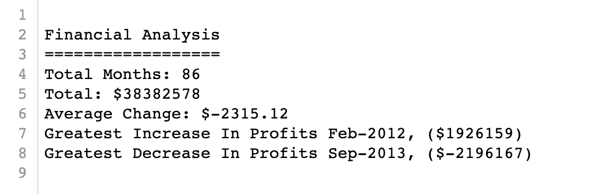
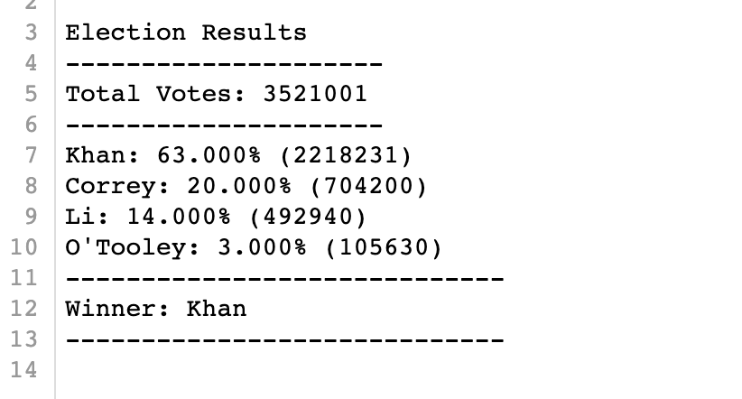

# PyBank and PyPoll Analysis
Conduct basic data analysis using Python

## Assignment 1: PyBank
Objective: Analyze company financial records

<b> Files </b>  
Date and Profit/Losses 

<b> Process </b>  
Create a Python script that analyzes the records to calculate each of the following:
- The total number of months included in the dataset
- The net total amount of “Profit/Losses” over the entire period
- The average of the changes in “Profit/Losses” over the entire period
- The greatest increase in profits (date and amount) over the entire period
- The greatest decrease in losses (date and amount) over the entire period

<b> Results </b>   

## Assignment 2: PyPoll
Objective: Modernize vote-count process for a small, rural town 

<b> Files </b>  
Voter ID, County, Candidate

<b> Process </b>  
Create a Python script that analyzes the votes and calculates each of the following:
- Total number of votes cast
- Complete list of candidates who received votes
- Percentage of votes each candidate won
- Total number of votes each candidate won
- Winner of the election based on popular vote

<b> Results </b>   

